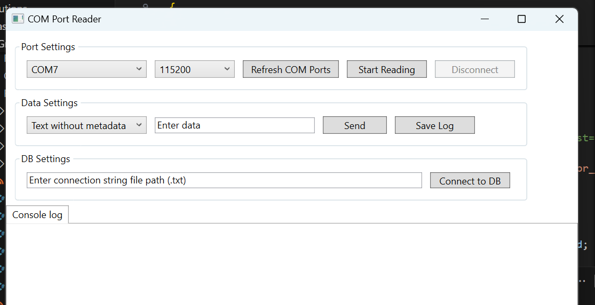

# Remake of GND Receiver
  

## Important steps
 - Select proper COM port - mostly by guessing on which is your usb receiver connected
 - Baudrate and other settings should work out of the box, if not good luck digging trough the modem docs to reconfig it using SW in chinese
- If above is OK click **Start reading**. If you want to connect to your prepared DB (tables, columns with proper names and settings), you have to create a `.txt` file containing your connection string, make sure this program has permission to read it, and specify it in the hardcoded string somewhere in the `ConnStrGatherer` subprogram, or, if you feel lucky, try the GUI input.  
    - Try playing with it & remember: if it works right away, it's bad—problems will appear, but when you don't have time to solve them... pray to have problems to solve at the right time: at home, not when day D comes—general effect.  

    Later you can visualize your data via Excel or software like Grafana.  
    Set up your DB with a tool like PGadmin or use the not tested vibe-coded example ([here](Solutions/Basic/GroundStation/Remake of GND receiver/PostgreSQL_Setup.sql)).
***WARN: Vibe-Coded material - no guarantee provided***
## Overview

This project is a remake of the Ground Station receiver for the CanSat system. It is designed to receive, process, and log telemetry data from CanSat nodes via serial communication.

## Features

- Serial port management for data reception
- Telemetry data parsing and processing
- Logging of received data to files
- Database integration for persistent storage
- Configurable connection strings
- User interface for monitoring and control

## Main Components

- **MainWindow.xaml.cs**: The main UI logic and event handling.
- **SerialPortManager.cs**: Handles serial port connections and data reception.
- **TelemetryProcessor.cs**: Parses and processes incoming telemetry data.
- **FileLogger.cs**: Logs received data to files.
- **DatabaseManager.cs**: Manages database operations for storing telemetry.
- **ConnStrGatherer.cs**: Gathers and manages connection strings for database access.

## Getting Started

1. Open `Remake of GND receiver.sln` in Visual Studio.
2. Build the solution.
3. Connect the CanSat receiver hardware via serial port.
4. Run the application and configure the serial port and database settings as needed.

## Usage

- Select the appropriate serial port in the UI.
- Start receiving data.
- Monitor telemetry in real-time.
- Data is automatically logged and stored in the configured database.

## File Structure

- `MainWindow.xaml` / `MainWindow.xaml.cs`: UI and main logic
- `SerialPortManager.cs`: Serial communication
- `TelemetryProcessor.cs`: Data parsing
- `FileLogger.cs`: File logging
- `DatabaseManager.cs`: Database operations
- `ConnStrGatherer.cs`: Connection string management

## Dependencies

- .NET 8.0 (Windows)
- Npgsql (PostgreSQL database driver)
- System.IO.Ports (Serial communication)
- LiveCharts (UI charting)

## Contributing

Feel free to submit issues or pull requests for improvements.

## License

MIT License

# This GUI receives from the modem
sample stored data are available at the sensor_data.csv file in this directory.  
Received data will be stored in a postgreSQL DB in the future._
